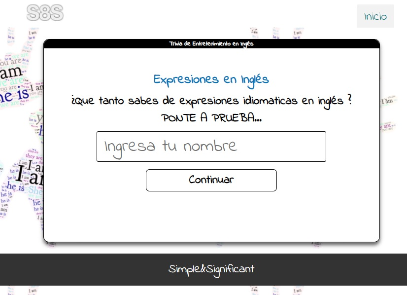

# Trivia Expresiones en Inglés
Es un juego de trivia de expresiones idiomaticas en Inglés o Idioms, el cual se clasifica en Idioms sobre comida, sobre animales y dichos, donde se pone a prueba tus conocimientos en este tema.

## Demo

En la pagina 1 se encuentra la descripcion del juego y el participante puede ingresar su nombre.

En la pagina 2 puedes escoger el tema de la trivia

Cada trivia tiene cuatro opciones de respuestas, el usuario tiene 15 segundos para responder la pregunta.

Al finalizar las 3 trivias el usuario tiene la posibilidad de mirar su puntaje en el juego, ver las respuestas, jugar con otro tema o iniciar con un nuevo nombre de usuario.

